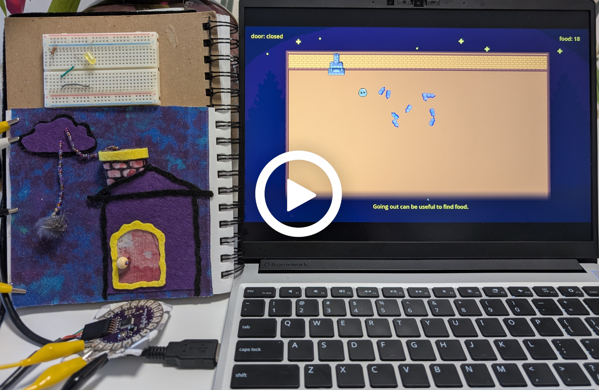
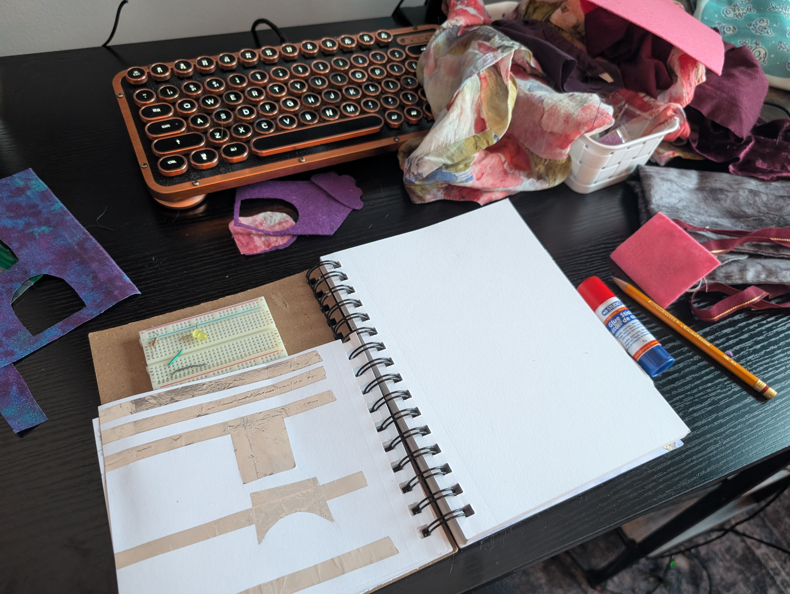
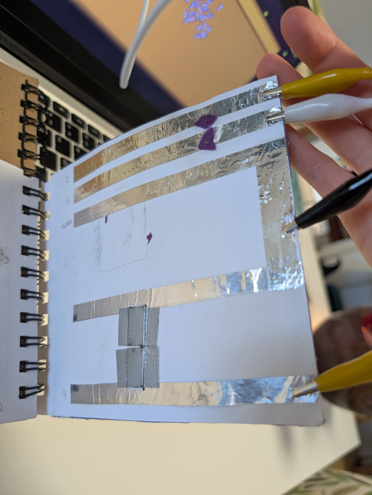
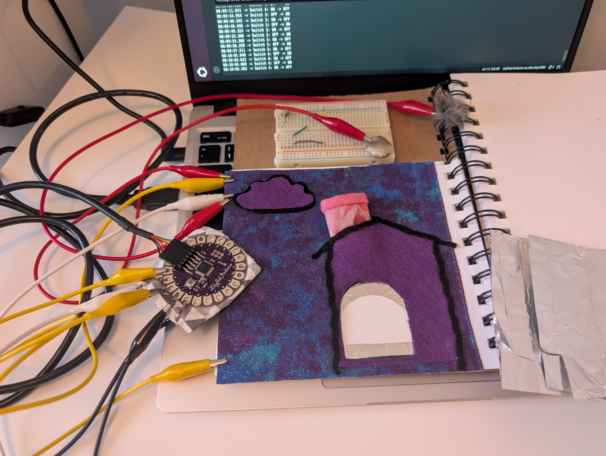
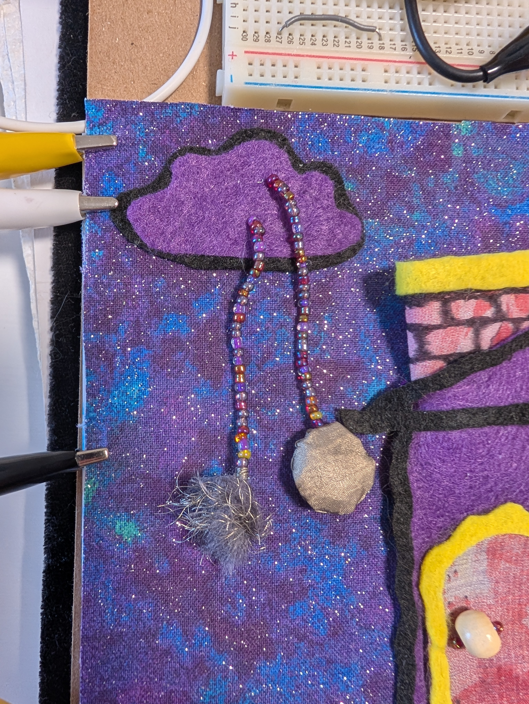
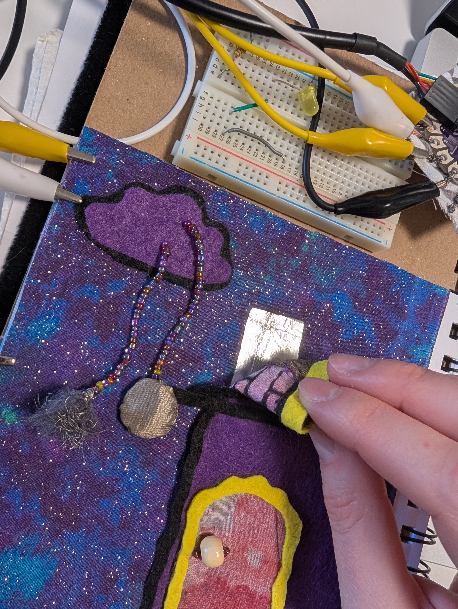
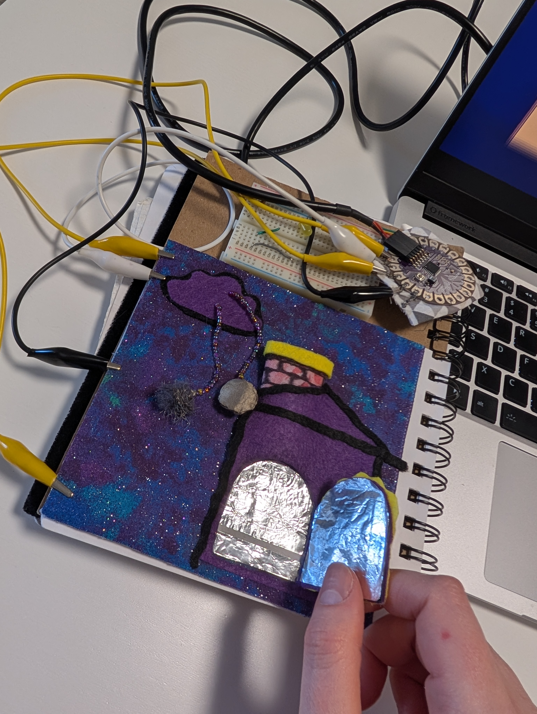
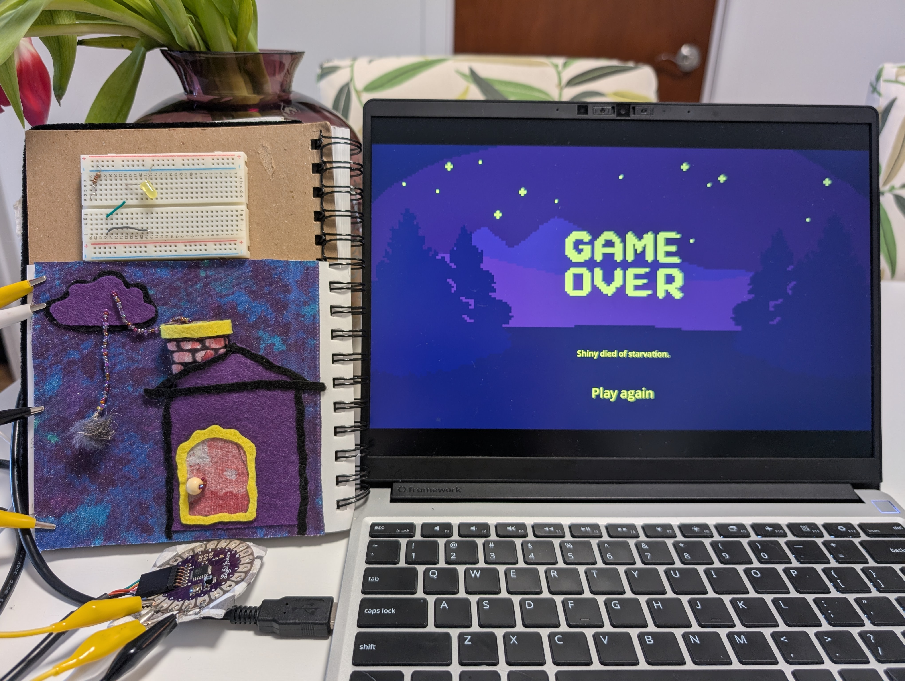

## Open the door

A playful physical computing project. The goal was to explore techniques, get a few signals from the physical world into an on-screen world and see what kind of interactions happen.

The result is a toy house with 2 minimal interactions:
- a physical door which when open lets objects fly into an on-screen house
- a chimney, through which 2 characters can be sent to the on-screen house

Going from the basic interactions to more developed gameplay would be a next direction to explore.

Tools and materials: Godot, Arduino, Gimp, conductive thread and fabric, paper, aluminum foil, felt, beads, fabric.

### Process and learnings

For the physical part, time and space constraints pushed me to prototyping in a sketchbook. First I made a few on/off switches out of paper and aluminum foil. Testing them with a LED on a breadboard was very portable, I could sit down almost anywhere and make a prototype in 30 minutes.

<video src="https://github.com/user-attachments/assets/2052355c-0cde-4c4c-be01-4044f374f3db" controls width="500"></video>

I then wired the switches to an Arduino pin.

<video src="https://github.com/user-attachments/assets/e88739cb-8880-45e1-84c7-b4c342f80093" controls width="500"></video>

For the on-screen part, I learned how to use the Godot game engine. As a first simple step, I made circles appear on screen, a "hello world" program of sorts. Later I learned how to make objects and characters appear and move, integrate some found assets like tilesets and animations as well as some of my old pixel art, and add a bit of game logic.

<video src="https://github.com/user-attachments/assets/9c0e6dc3-7059-427a-bbf0-39bc90a9c1f2" controls width="500"></video>

I picked a couple favorite physical switches and experimented with textures and materials: felt, beads, fabric. 

One "character" is made from faux fur with conductive thread woven in. The other is made from conductive fabric. 

Getting the circuit to be reliable took a bit of trial and error. The chimney is lined with conductive fabric and connected to ground. Each character is wired to its own Arduino pin, placing it in the chimney closes the circuit.

More learning happened when putting the prototype in people's hands and watching them get confused or amused by things I didn't expect. Some would get very focused on the controller and never realize that opening the door causes things to happen on screen. I added a simple lose condition to have a reason to go in and out of the house, but otherwise there's not much to do, so it would be interesting to explore more complex interactions.

Why did I make this? If I told my 15 year old self that she'd get to write code and do sewing to make a silly interactive thing, she would be very excited. The now 30-something is pretty happy too.

### AI usage

AI was helpful for tech research, debugging and scoping technical tasks. I didn't use AI for visuals: used found assets and some of my old art. The process of technical problem solving leaked a bit into idea generation and pruning, I don't know how to feel about it yet.

### References & Credits

- A great resource on making soft physical sensors and much more: https://howtogetwhatyouwant.at/
- Vanish animation from: Super Pixel Effects Gigapack (Free Version) v1.9.0 - Will Tice / unTied Games
- Tileset from: Super Retro World Interior Pack by The low-res arist (Twitter @Pixelart_asset)

Dev notes

To run everything:

- Plug in Arduino + circuit
- Run the bridge script to listen to serial port: python3 listen_to_door.py
- Run the game

